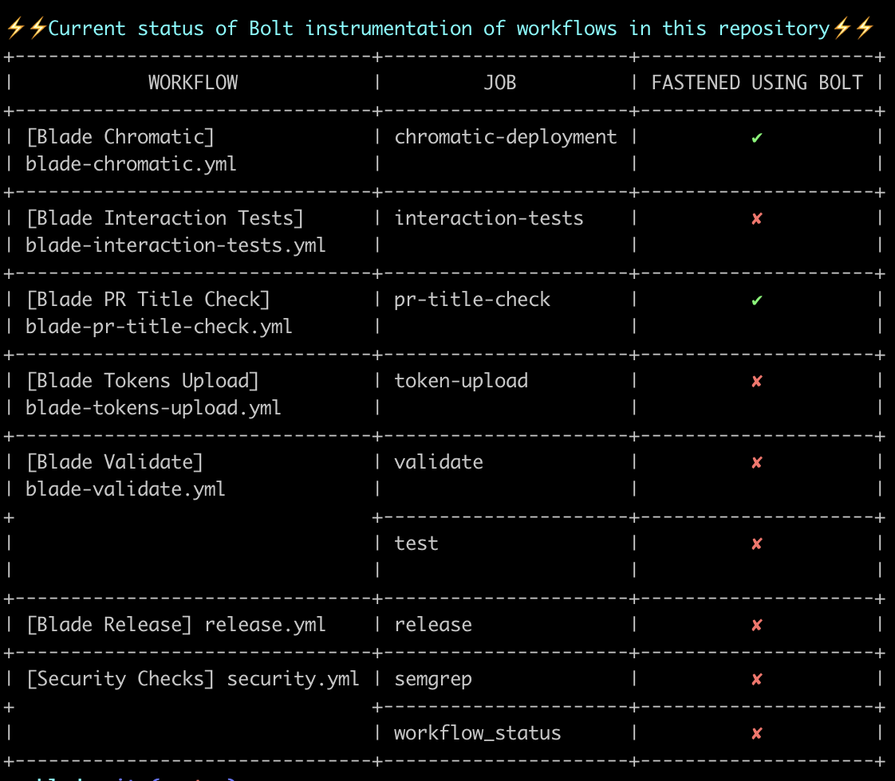
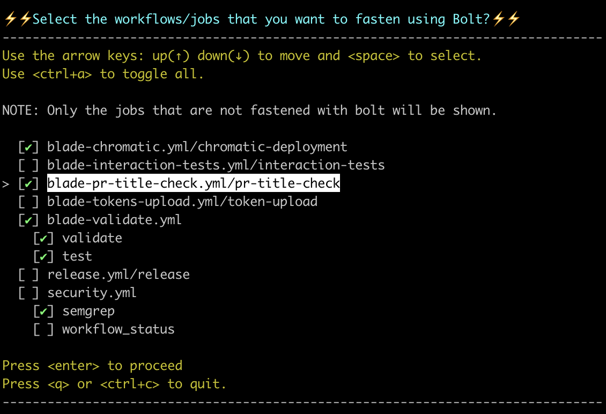

# Bolt-CLI

A command line interface to orchestrate [Bolt](https://www.github.com/koalalab-inc/bolt) in your GitHub repositories.

# Contents
* [Example](#example)
    * [Check Status](#check-current-status)
    * [Fasten Workflow Jobs](#fasten-workflow-jobs)
* [Usage](#usage)
    * [Fasten](#fasten)
    * [Scan](#scan)
* [Installation](#installation)
    * [Docker image](#docker-image)
    * [Precompiled binary](#precompiled-binary)

## Example:
* #### Check Current Status
    
* #### Sample Run on Razorpay Blade Repository
    
* #### Fasten Workflow Jobs
    
* #### Sample Run on Razorpay Blade Repository
    

## Usage:
To check the status of Bolt instrumentation in your repository, run the following command in your repository's root directory:
```bash
bolt-cli scan
```

To fasten the workflow jobs in your repository using Bolt, run the following command in your repository's root directory:
```bash
bolt-cli fasten
```
This is an interactive command that will give you a list of all the workflow jobs in your repository. You can select the jobs you want to fasten and the command will automatically update the workflow files in your repository. Use arrow keys to move `up` and `down`. Use `Space Bar`  to toggle selection of highlighted job/workflow. Press `Ctrl+a` to toggle between `select all` and `select none`. Press `Enter` to confirm your selection.

After following the above steps, Bolt-CLI will instrument the selected jobs in your repository. You can then commit and push the changes to your repository.

To learn more
```bash
bolt-cli fasten --help
```

Once you have instrumented the workflows in your repository, you can check the egress report in summary section of the workflow runs under actions tab in your repository.

## Installation:
* #### Docker Image
     Get the version from the releases section and run the following command(Replace 0.0.5 with the version you want to use)
    ```bash
    docker run -v "$(pwd):/app" -w /app -u $(id -u):$(id -g) -it ghcr.io/koalalab-inc/bolt-cli:0.0.5 scan 
    ```
    You can alias this command to `bolt-cli` for ease of use
    ```bash
    alias bolt-cli='docker run -v "$(pwd):/app" -w /app -u $(id -u):$(id -g) -it ghcr.io/koalalab-inc/bolt-cli:0.0.5'
    ```
    Now you can use `bolt-cli` as a command line tool
    ```bash
    bolt-cli scan
    ```
    ```bash
    bolt-cli fasten
    ```
* #### Precompiled Binary
    Get the version from the releases section and run the following command(Replace version, os and arch as per your system)<br />
    Following command will download the archive containing binary for MacOS x86_64
    ```bash
    curl -fsSL https://github.com/koalalab-inc/bolt-cli/releases/download/v0.0.5/bolt-cli_Darwin_x86_64.tar.gz 
    ```

    To download and place the binary in `/usr/local/bin` run the following command
    ```bash
    curl -fsSL https://github.com/koalalab-inc/bolt-cli/releases/download/v0.0.5/bolt-cli_Darwin_x86_64.tar.gz | tar -xz -C "/usr/local/bin/" "bolt-cli"
    ```

    On MacOS, if you get an error like `Cannot Verify That This App is Free from Malware` Or `This app is from an unidentified developer`, you can run the following command to allow the binary to run
    ```bash
    sudo xattr -d com.apple.quarantine /usr/local/bin/bolt-cli
    ```

